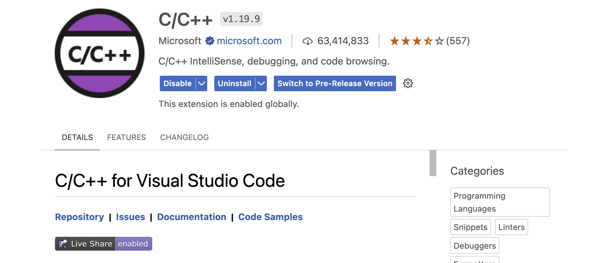

# Setting Up Development Environment

## HackerRack Challenge Set up

### Installing a C++ compiler (e.g., GCC, Clang)

### GCC (GNU Compiler Collection)

You can install GCC on macOS using package managers like Homebrew or MacPorts.

- **Using Homebrew**:
  - Install Homebrew if you haven't already by following the instructions on [brew.sh](https://brew.sh/).
  - Once Homebrew is installed, you can install GCC by running:

    ```terminal

    brew install gcc
    ```

- **Using MacPorts**:
  - Install MacPorts from [macports.org](https://www.macports.org/install.php) if you haven't already.
  - After installing MacPorts, you can install GCC by running:

    ```terminal 
    
    sudo port install gcc
    ```

### Clang

Clang is included in Xcode Command Line Tools. You can install it by following these steps:

- Install Xcode from the Mac App Store if you haven't already.
- After installing Xcode, open Terminal and install the command line tools by running:

  ```
  xcode-select --install
  ```

Once you've installed GCC or Clang, you can verify the installation by checking their versions using the following commands:

- For GCC (if installed via Homebrew):

  ```terminal

  gcc --version

  ```

- For Clang (included with Xcode Command Line Tools):

  ```terminal

  clang --version
  ```

### Choosing an Integrated Development Environment (IDE) or text editor (e.g., Visual Studio Code, Code::Blocks, CLion)



### Configuring the development environment
